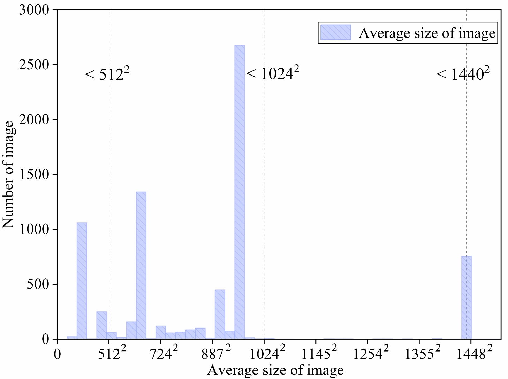
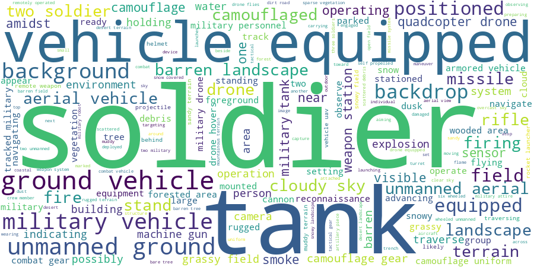

# **M**ilitary **O**bjects Dataset in Real **Co**mbat (MOCO)


<p align="center"><a href="https://panlizhi.github.io">Lizhi Pan</a>, <a href="https://smen.bit.edu.cn/szdw/szml/tcykzgcx/qb05/721aa3c324ec4a20912425153613e881.htm">Chengtian Song</a> </p>

<p align="center">School of Mechatronical Engineering<br>Beijing Institute of Technology</p>

<p align="center"><a href="http://panlizhi.github.io/files/MAE-MilitIC.pdf">[Paper:MAE-MilitIC]</a></p>


<div style="display: flex; justify-content: space-around; align-items: center; flex-wrap: nowrap;">
  
  
</div>

| Dataset | Number of images | Number of captions |
|---------|------------------|--------------------|
| Train   | 7192             | 35,960             |
| Test    | 257              | 1,285              |

# Abstract
Our work provided the Military Objects In Real Combat (MOCO) dataset, which includes 7461 images with 33705
captions, and has the advantage of offering a rich set of captions for real military combat scenarios. This dataset is
particularly beneficial for the research on military image captioning, as it provides a large and diverse collection of
images accompanied by detailed captions. The open access nature of the MOCO dataset also ensures that it can
be widely utilized by the research community, fostering innovation and collaboration in the field of military image
analysis.
# Download
Google Drive link
```
https://drive.google.com/drive/folders/1IODxmem_PFbfwem_zVxY9WprTYWuYvXo?usp=sharing
```
Baidu Netdisk link:
```
https://pan.baidu.com/s/1nWajm27cfUpYMT1gpBAbew
password: rvmc
```
If the link becomes invalid, please do not hesitate to contact me for an update.

# License
This dataset is licensed under the MIT License Copyright (c) 2024 Panlizhi.

Please ensure you have read and understood the terms of the license before using the dataset.
If you agree to comply with the MIT License, please proceed with using the dataset.

# Citation
If you find the data presented herein useful for your research, please consider citing our article：
**MAE-MilitIC: Map Augmentation Embedding to Enhance Semantics for Military Image Captioning**(http://panlizhi.github.io/files/MAE-MilitIC.pdf)
 
